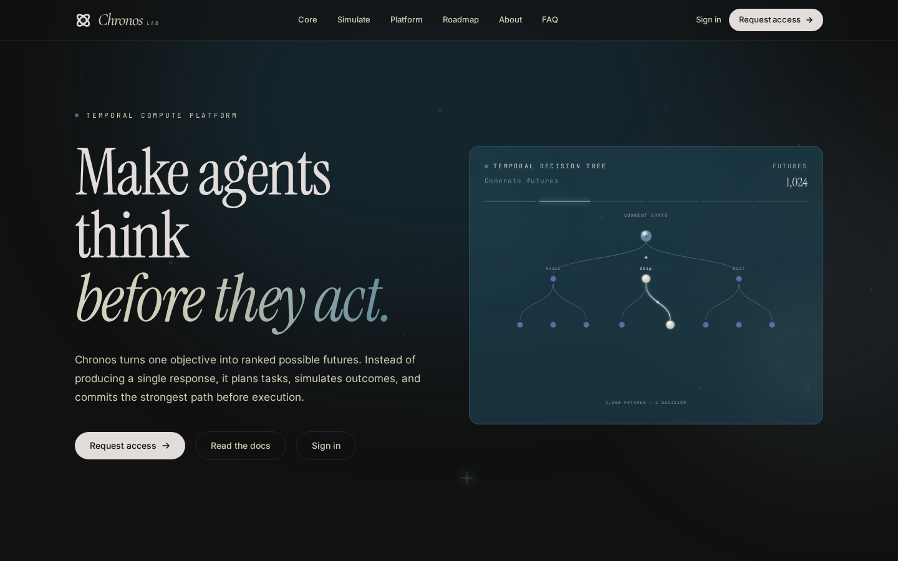

# Chronos Lab

[](https://chronoslab.space)
[](./LICENSE)

**Decision intelligence that explores multiple futures before you commit.**

Chronos is a temporal compute platform: it plans work, simulates possible strategies, evaluates trade-offs, and ranks the strongest path — for people and autonomous agents.

🌐 **Live**: [chronoslab.space](https://chronoslab.space)

<p align="center">
  <a href="https://chronoslab.space">
    
  </a>
</p>

Link previews (X, Slack, iMessage, LinkedIn) use the Open Graph card at  
`https://chronoslab.space/og-image.png` (`public/og-image.png`).

---

## What is Chronos?

Most AI returns a single answer. Chronos returns a **decision**:

```text
Goal → Gather context → Generate futures → Evaluate trade-offs
    → Rank outcomes → Recommend the best path
```

Use it when the cost of a wrong path is high — product launches, capital allocation, research strategy, or agent planning that must think before it acts.

### Product surfaces

| Surface | What it is |
|--------|------------|
| **Public site** | Marketing, simulator, docs, FAQ |
| **Private workspace** | Goals, knowledge library, simulations, timeline, memory |
| **Docs** | Product documentation (`/docs`, page header: Cerebrum) |
| **Grok advisor** | Workspace-aware guidance (via Supabase Edge Function) |

---

## Quick start

```bash
# Clone
git clone https://github.com/Chronos-Lab-Space/Chronos.git
cd Chronos

# Install
npm install

# Configure
cp .env.example .env
# Set VITE_SUPABASE_URL and VITE_SUPABASE_ANON_KEY

# Apply database schema (Supabase SQL editor)
# Prefer migrations under supabase/migrations/
# or bootstrap with supabase/schema.sql

# Dev
npm run dev

# Unit tests
npm run test:unit

# Production build (includes GH Pages 404 fallback)
npm run build
```

Open [http://localhost:5173](http://localhost:5173).

### Environment

| Variable | Purpose |
|----------|---------|
| `VITE_SUPABASE_URL` | Supabase project URL |
| `VITE_SUPABASE_ANON_KEY` | Supabase anon key (browser) |
| `VITE_MOCK_ACCESS_REQUESTS` | Optional — mock access form |
| `XAI_API_KEY` | **Server-only** Edge Function secret for Grok (never `VITE_`) |

See [`.env.example`](./.env.example).

---

## Stack

| Layer | Tech |
|-------|------|
| UI | React 19, Vite 7, Tailwind CSS 4, TypeScript |
| Routing | React Router 7 (BrowserRouter) |
| Backend | Supabase (Auth, Postgres, RLS, Edge Functions) |
| AI | Grok (xAI) via authenticated Edge Function proxy |
| Tests | Vitest, Testing Library, Playwright |
| Deploy | Static SPA (Vercel / GitHub Pages) |

---

## Project structure

```text
src/
├── domain/           # Pure models: Chronos engine, workspace types, gates
├── application/      # Use cases: planner, simulation engine, workspace service
├── infrastructure/   # Supabase, auth, local store, caches, repositories
├── presentation/     # React app, marketing pages, workspace UI
│   ├── components/   # Site shell, docs, FAQ, changelog
│   └── features/     # Workspace, knowledge, simulation, memory, planner
├── main.tsx
└── index.css
supabase/
├── migrations/       # Schema evolution (workspaces, sims, versioning, …)
├── functions/grok/   # Edge Function → api.x.ai
└── schema.sql        # Bootstrap reference (keep aligned with migrations)
```

Architecture rules: [ARCHITECTURE.md](./ARCHITECTURE.md)  
Performance notes: [PERFORMANCE.md](./PERFORMANCE.md)  
Testing strategy: [TESTING.md](./TESTING.md)

---

## Key routes

| Path | Description |
|------|-------------|
| `/` | Landing — hero, live demo, product story |
| `/simulate` | Public startup simulator (~1,000 futures) |
| `/docs` | Documentation (Cerebrum header) |
| `/faq` | Short product FAQ |
| `/changelog` | Ship notes |
| `/login` | Auth (magic link / password) |
| `/workspace` | Private HQ (auth required) |
| `/workspace/knowledge` | Knowledge Library |
| `/workspace/simulations` | Run & review simulations |
| `/workspace/memory` | Versioned decision history |
| `/workspace/advisor` | Grok workspace advisor |
| `/platform` · `/roadmap` · `/about` | Product & company |

Legacy `/dashboard` redirects to `/workspace`.

---

## Workspace loop (private beta)

```text
Sign in → Create workspace → Set goal → Upload knowledge
       → Run simulation → Review report & timeline → Re-run / memory
```

Persistence is **local-first with cloud dual-write**:

- `localStorage` for instant resume  
- Supabase for durable multi-session memory when authenticated  
- Load **merges** remote + local simulation history and **backfills** empty cloud from local  

---

## Public simulator

The home live demo and `/simulate` share `publicStartupSimulator`:

1. Decompose the objective into a **task graph**  
2. Simulate ranked go-to-market paths  
3. Collapse to best path + alternatives (ARR, probability, roadmap)  

Deterministic for a given prompt (cacheable).

---

## Scripts

```bash
npm run dev        # Vite dev server
npm run build      # Production bundle + 404.html for SPA hosts
npm run preview    # Preview production build
npm run test:unit  # Vitest
npm run test:e2e   # Playwright (install browsers first)
```

```bash
npx playwright install chromium
npm run test:e2e
```

---

## Temporal engine (core idea)

```text
Timeline → Branch → Evaluate → Prune → Collapse → Memory
```

Chronos executes **tasks and capabilities**, not fixed agent personas. Planners build dependency graphs; the runtime forks futures, scores them, and keeps lineage for audit and re-runs.

Agent OS sketch:

```text
Planner → Task Graph → Scheduler → Execution
        → Memory → Evaluation → Timeline ranking
```

---

## Contributing

This repository is the **public product surface** for Chronos Lab (site, workspace UI, docs, simulator). Bug reports and suggestions are welcome via GitHub Issues.

---

## License

MIT © 2026 Chronos Lab. See [LICENSE](./LICENSE).

## Links

- Website: [chronoslab.space](https://chronoslab.space)  
- Docs: [chronoslab.space/docs](https://chronoslab.space/docs)  
- X: [@chronoslabspace](https://x.com/chronoslabspace)  
- Telegram: [join group](https://t.me/+I9MN0GfvgwllZGRh)  
- GitHub: [Chronos-Lab-Space/Chronos](https://github.com/Chronos-Lab-Space/Chronos)
